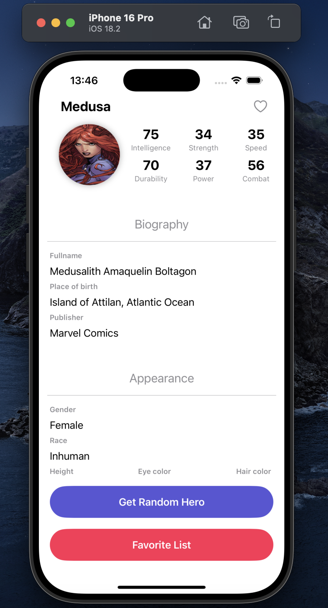
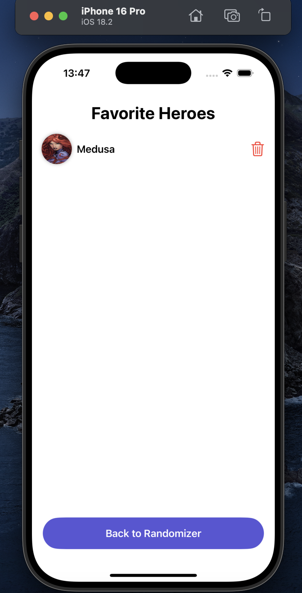

# iOS Development Assignment: HeroRandomizer App

## Overview
I created HeroRandomizer App which uses SuperHero API.

## Functionality
- There is a button **Get random Hero** that randomly shows some hero from the API.
- Each hero is presented with an interface like a social media profile.
- You can also click on the hero's like on the top right and see the list of favorites by clicking on the button **Favorite List**.
- In this list there is an option to remove a hero from favorites.
- Animation is also used when the interface transitions between characters.

## Implementation
1. The project is created as UIKit and the rootViewController is configured via SceneDelegate. It uses UIHostingController to display the SwiftUI view inside UIKit.
2. First, I created a Hero model with all the necessary attributes from the API.
3. Then I created the necessary functions in ViewModel: 
    - fetchHeroes() - loads all heroes from the API, decodes them from JSON to Hero struct and saves everything to the allHeroes array
    - fetchRandomHero() - randomly selects one hero from the array
    - toggleFavorite() - adds heroes to the Favorite list if they are not there, and removes them if they are there
    - isFavorite() - checks if a certain hero is in the Favorites list and returns a bool response
    - toggleFavoritesView() - switches screens between Favorite list and Randomizer by changing the value of showFavorites
4. The interface is implemented via SwiftUI with all required stacks

## Screenshots

